# 100 Free AI UI Components

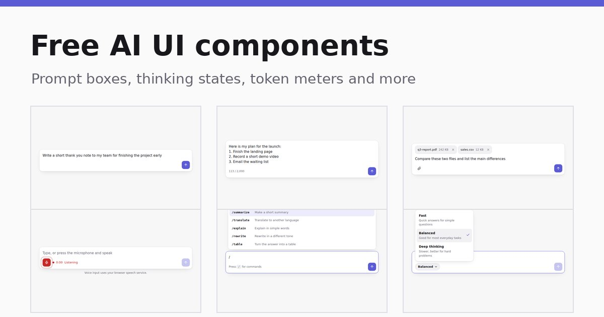

The parts every AI app needs: prompt boxes, thinking animations, token meters, answer ratings, agent tool calls and more. Each component is one HTML file with plain CSS and JavaScript. No library, no build step.

**[See every component with a live demo](https://mmrahmanbappi.github.io/100-free-ai-ui-components/)**

90 of 100 components are ready. New ones are added every week.

## Why use these components

- **One file each.** Copy it into any site, or move the markup into React, Vue or Svelte.
- **Light and dark mode.** Follows the device setting automatically.
- **Accessible.** Keyboard support and labels for screen readers.
- **Works on phones.** Every component fits small screens.
- **Easy to rebrand.** Change `--accent` at the top of the CSS.
- **Free for business use.** MIT license.

## How to use a component

1. Open the [website](https://mmrahmanbappi.github.io/100-free-ai-ui-components/) and pick a component.
2. Try the live demo in light and dark mode.
3. Click **Copy the code** or **Download the file**, then connect it to your AI service.

The components are the interface only. They do not call any AI model, so you can use them with any provider.

## Components

### Prompt Input

Boxes where people type to the AI, from a simple field to slash commands and history.

| Preview | Component |
|---|---|
| [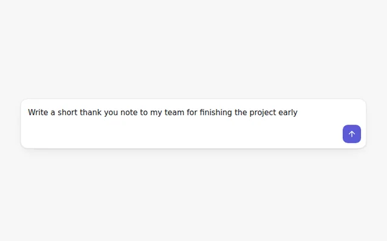](https://mmrahmanbappi.github.io/100-free-ai-ui-components/prompt-input/basic-prompt-box/) | **[Basic Prompt Box](https://mmrahmanbappi.github.io/100-free-ai-ui-components/prompt-input/basic-prompt-box/)** A clean prompt box. Enter sends, Shift and Enter adds a new line, and the send button stays off until there is text. |
| [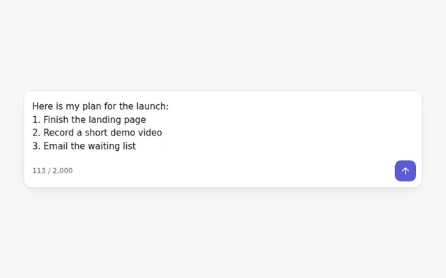](https://mmrahmanbappi.github.io/100-free-ai-ui-components/prompt-input/auto-grow-prompt/) | **[Auto-Growing Prompt](https://mmrahmanbappi.github.io/100-free-ai-ui-components/prompt-input/auto-grow-prompt/)** A prompt that grows as people type, stops at a set height and then scrolls. Shows a live character count. |
| [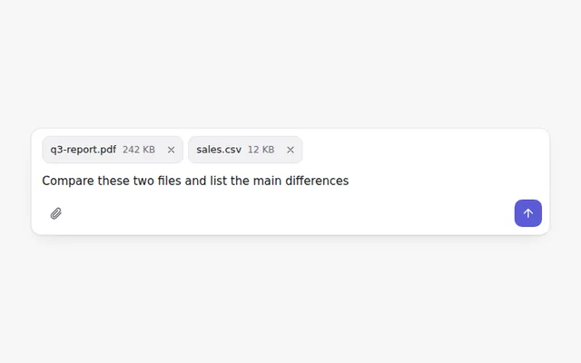](https://mmrahmanbappi.github.io/100-free-ai-ui-components/prompt-input/prompt-with-attachments/) | **[Prompt with File Attachments](https://mmrahmanbappi.github.io/100-free-ai-ui-components/prompt-input/prompt-with-attachments/)** Attach files with a button or by dragging them onto the box. Each file shows as a chip with its size and a remove button. |
| [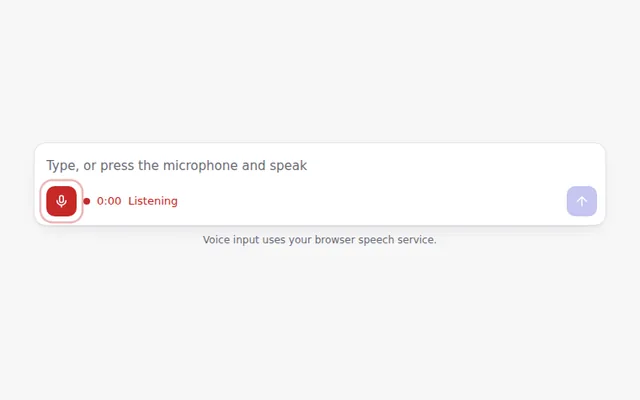](https://mmrahmanbappi.github.io/100-free-ai-ui-components/prompt-input/voice-input-prompt/) | **[Prompt with Voice Input](https://mmrahmanbappi.github.io/100-free-ai-ui-components/prompt-input/voice-input-prompt/)** A microphone button that turns speech into text when the browser supports it, with a pulsing record state and a timer. |
| [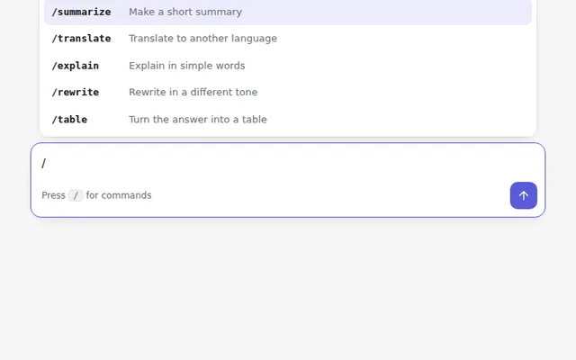](https://mmrahmanbappi.github.io/100-free-ai-ui-components/prompt-input/slash-commands-prompt/) | **[Prompt with Slash Commands](https://mmrahmanbappi.github.io/100-free-ai-ui-components/prompt-input/slash-commands-prompt/)** Type a slash to open a command menu. Use the arrow keys to move, Enter to pick, and Escape to close. |
| [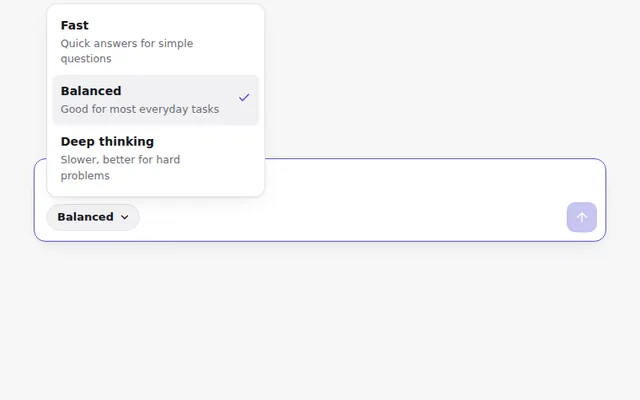](https://mmrahmanbappi.github.io/100-free-ai-ui-components/prompt-input/model-picker-prompt/) | **[Prompt with Model Picker](https://mmrahmanbappi.github.io/100-free-ai-ui-components/prompt-input/model-picker-prompt/)** A prompt box with a small menu to choose how the AI should answer: fast, balanced or deep thinking. |
| [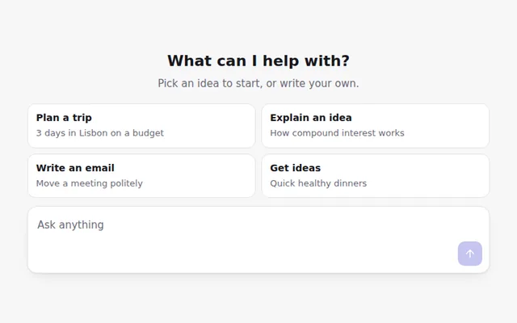](https://mmrahmanbappi.github.io/100-free-ai-ui-components/prompt-input/prompt-suggestions/) | **[Prompt Suggestions](https://mmrahmanbappi.github.io/100-free-ai-ui-components/prompt-input/prompt-suggestions/)** Starter ideas shown as buttons above an empty prompt. Clicking one fills the box so people can edit it before sending. |
| [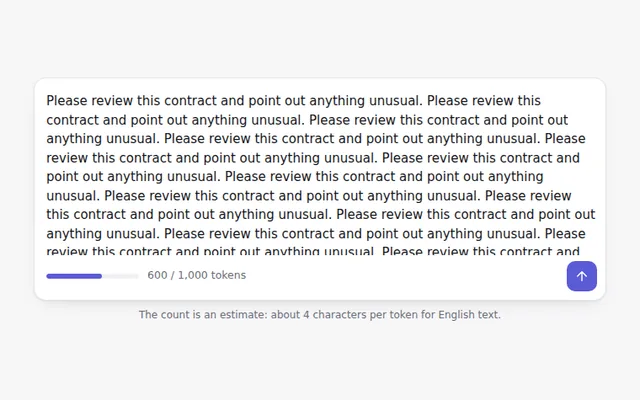](https://mmrahmanbappi.github.io/100-free-ai-ui-components/prompt-input/prompt-token-counter/) | **[Prompt with Token Counter](https://mmrahmanbappi.github.io/100-free-ai-ui-components/prompt-input/prompt-token-counter/)** Estimates how many tokens a prompt will use as people type, with a bar that turns orange and then red near the limit. |
| [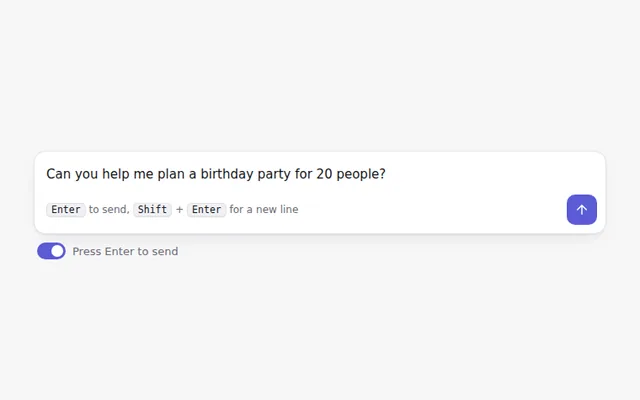](https://mmrahmanbappi.github.io/100-free-ai-ui-components/prompt-input/send-shortcut-prompt/) | **[Prompt with Send Shortcut Setting](https://mmrahmanbappi.github.io/100-free-ai-ui-components/prompt-input/send-shortcut-prompt/)** Lets people choose whether Enter sends the message or adds a new line, with a keyboard hint that updates to match. |
| [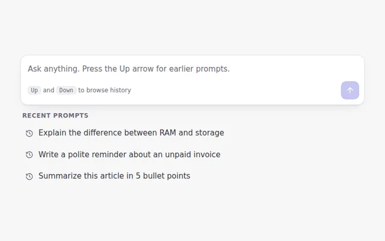](https://mmrahmanbappi.github.io/100-free-ai-ui-components/prompt-input/prompt-history/) | **[Prompt with History](https://mmrahmanbappi.github.io/100-free-ai-ui-components/prompt-input/prompt-history/)** Press the Up arrow in an empty box to bring back earlier prompts, like a terminal. Recent prompts also appear as a list. |

### Thinking and Loading

Animations and states that show the AI is working, streaming or using a tool.

| Preview | Component |
|---|---|
| [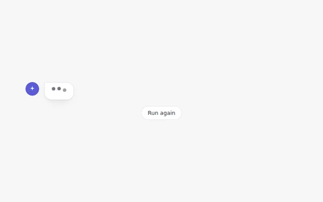](https://mmrahmanbappi.github.io/100-free-ai-ui-components/thinking/typing-dots/) | **[Typing Dots](https://mmrahmanbappi.github.io/100-free-ai-ui-components/thinking/typing-dots/)** Three bouncing dots inside an answer bubble, the classic sign that the AI is writing a reply. |
| [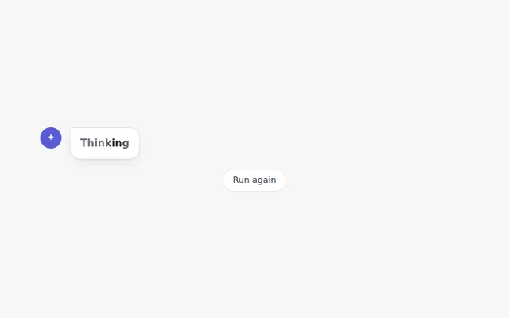](https://mmrahmanbappi.github.io/100-free-ai-ui-components/thinking/thinking-shimmer/) | **[Thinking Shimmer](https://mmrahmanbappi.github.io/100-free-ai-ui-components/thinking/thinking-shimmer/)** A soft light moves across the word Thinking while the AI works, then it changes to how long the thinking took. |
| [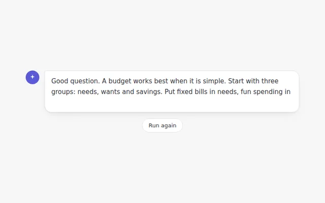](https://mmrahmanbappi.github.io/100-free-ai-ui-components/thinking/streaming-text/) | **[Streaming Text](https://mmrahmanbappi.github.io/100-free-ai-ui-components/thinking/streaming-text/)** The answer appears word by word with a blinking cursor, the way most AI chat apps show a reply as it is written. |
| [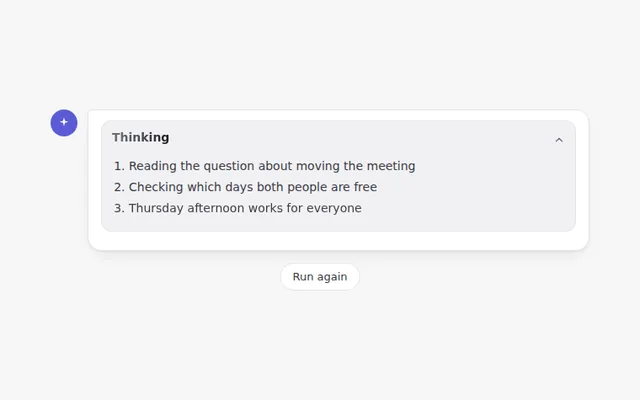](https://mmrahmanbappi.github.io/100-free-ai-ui-components/thinking/reasoning-panel/) | **[Reasoning Panel](https://mmrahmanbappi.github.io/100-free-ai-ui-components/thinking/reasoning-panel/)** A panel that shows each thinking step while the AI works, then folds itself away with a summary you can open again. |
| [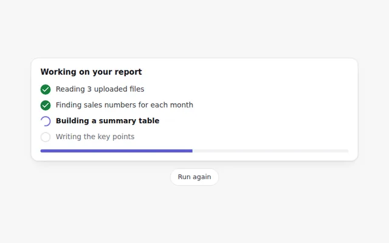](https://mmrahmanbappi.github.io/100-free-ai-ui-components/thinking/agent-progress-steps/) | **[Agent Progress Steps](https://mmrahmanbappi.github.io/100-free-ai-ui-components/thinking/agent-progress-steps/)** A checklist of what an AI agent is doing right now. Each step shows a spinner while it runs and a tick when it is done. |
| [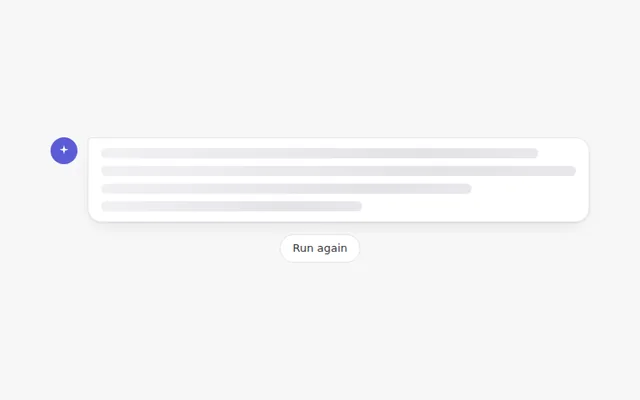](https://mmrahmanbappi.github.io/100-free-ai-ui-components/thinking/skeleton-message/) | **[Skeleton Message](https://mmrahmanbappi.github.io/100-free-ai-ui-components/thinking/skeleton-message/)** Grey placeholder lines with a moving shine that hold the space of the answer while it loads, so the page does not jump. |
| [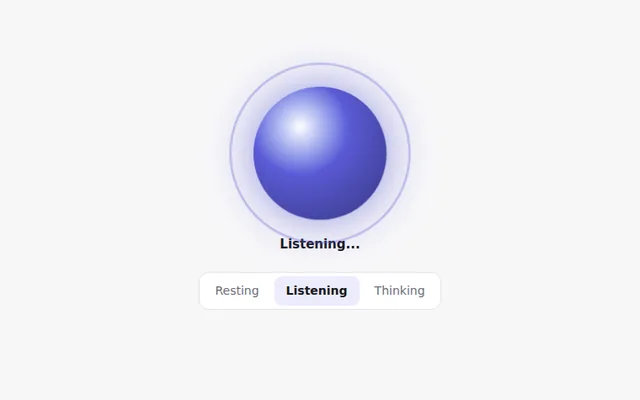](https://mmrahmanbappi.github.io/100-free-ai-ui-components/thinking/ai-orb/) | **[AI Orb](https://mmrahmanbappi.github.io/100-free-ai-ui-components/thinking/ai-orb/)** A glowing orb that shows what the assistant is doing: resting, listening or thinking. Great for voice and assistant screens. |
| [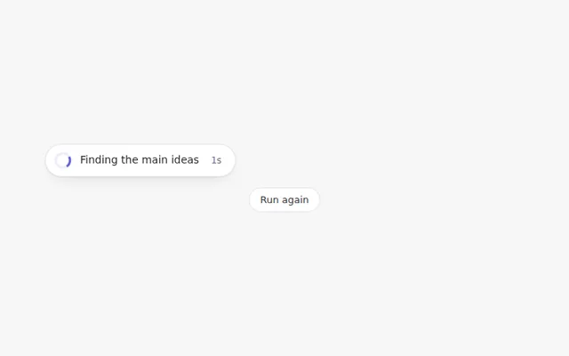](https://mmrahmanbappi.github.io/100-free-ai-ui-components/thinking/status-spinner/) | **[Spinner with Status Text](https://mmrahmanbappi.github.io/100-free-ai-ui-components/thinking/status-spinner/)** A small spinner with a line of text that changes as the work moves forward, so people know the AI has not frozen. |
| [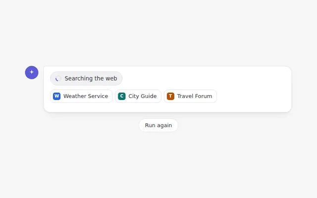](https://mmrahmanbappi.github.io/100-free-ai-ui-components/thinking/tool-call-indicator/) | **[Web Search Indicator](https://mmrahmanbappi.github.io/100-free-ai-ui-components/thinking/tool-call-indicator/)** Shows that the AI is searching the web, with sources popping in one by one, then a short summary of how many it found. |
| [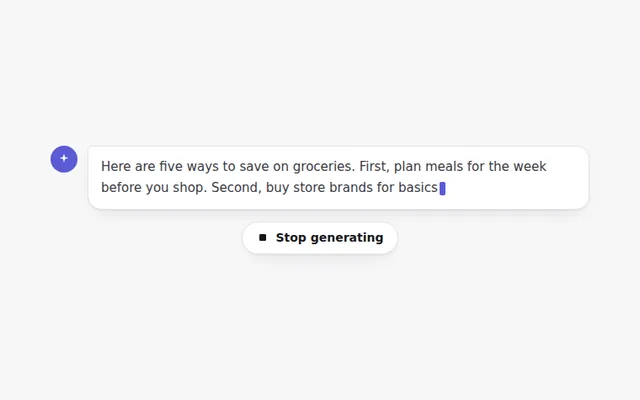](https://mmrahmanbappi.github.io/100-free-ai-ui-components/thinking/stop-generating/) | **[Stop Generating Button](https://mmrahmanbappi.github.io/100-free-ai-ui-components/thinking/stop-generating/)** A stop button that appears while the answer is being written. Stopping keeps what was written and offers to continue or try again. |

### Chat Messages

Message bubbles, code blocks, sources and actions for AI answers.

| Preview | Component |
|---|---|
| [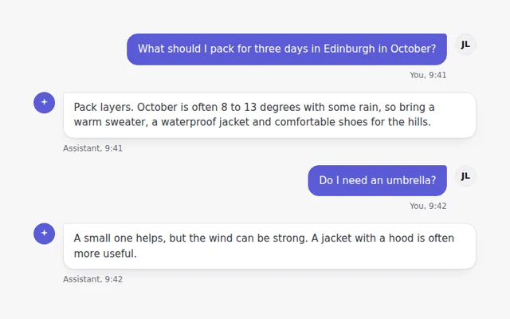](https://mmrahmanbappi.github.io/100-free-ai-ui-components/messages/chat-bubbles/) | **[Chat Bubbles](https://mmrahmanbappi.github.io/100-free-ai-ui-components/messages/chat-bubbles/)** A simple conversation with user and assistant bubbles, avatars and times. The user sits on the right in the brand color. |
| [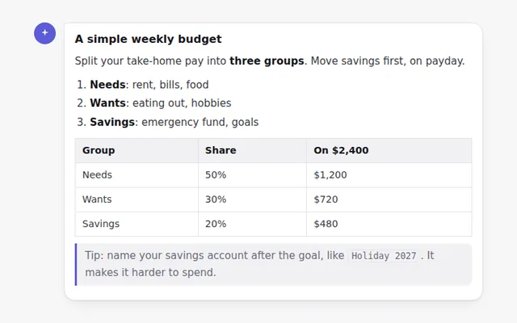](https://mmrahmanbappi.github.io/100-free-ai-ui-components/messages/formatted-answer/) | **[Formatted Answer](https://mmrahmanbappi.github.io/100-free-ai-ui-components/messages/formatted-answer/)** A styled answer with headings, lists, bold text, inline code, a quote and a table, ready for text your AI returns as Markdown. |
| [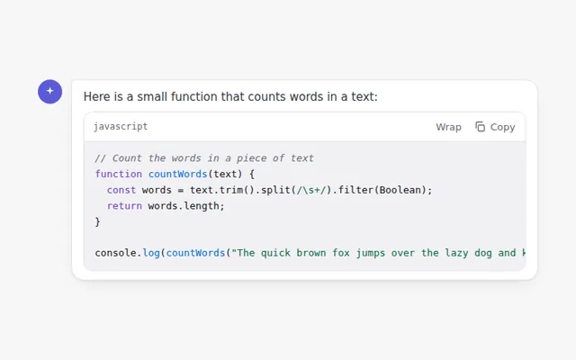](https://mmrahmanbappi.github.io/100-free-ai-ui-components/messages/code-block-copy/) | **[Code Block with Copy Button](https://mmrahmanbappi.github.io/100-free-ai-ui-components/messages/code-block-copy/)** A code block with a language label, a copy button that confirms when done, and a button to wrap long lines. |
| [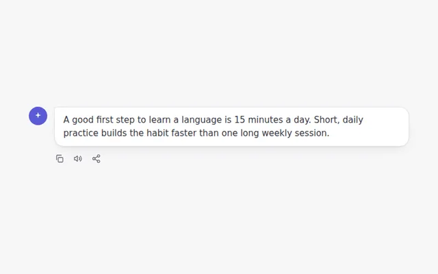](https://mmrahmanbappi.github.io/100-free-ai-ui-components/messages/message-actions/) | **[Message Action Bar](https://mmrahmanbappi.github.io/100-free-ai-ui-components/messages/message-actions/)** A row of actions under an answer: copy the text, read it aloud with the browser voice, and share it. |
| [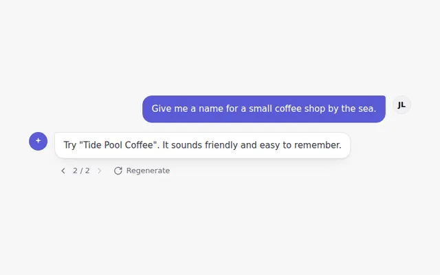](https://mmrahmanbappi.github.io/100-free-ai-ui-components/messages/answer-versions/) | **[Answer Versions](https://mmrahmanbappi.github.io/100-free-ai-ui-components/messages/answer-versions/)** Regenerate an answer and move between versions with small arrows showing 1 of 3, like popular chat apps do. |
| [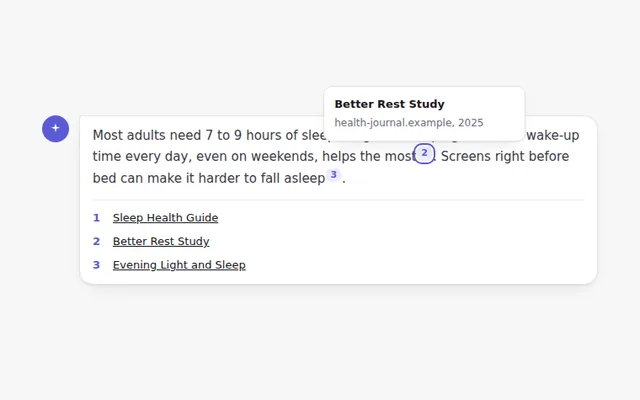](https://mmrahmanbappi.github.io/100-free-ai-ui-components/messages/inline-citations/) | **[Inline Citations](https://mmrahmanbappi.github.io/100-free-ai-ui-components/messages/inline-citations/)** Numbered source markers inside an answer. Hover or focus a number to see the source, and find the full list below. |
| [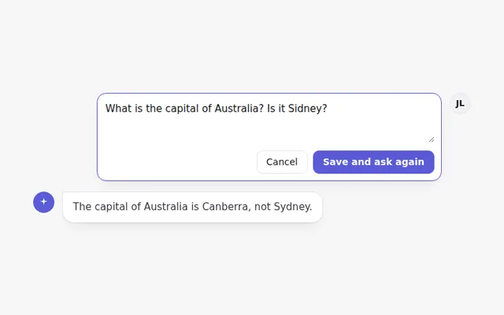](https://mmrahmanbappi.github.io/100-free-ai-ui-components/messages/edit-message/) | **[Editable User Message](https://mmrahmanbappi.github.io/100-free-ai-ui-components/messages/edit-message/)** An edit button on the user message turns it into a text box with Save and Cancel, so people can fix a question and ask again. |
| [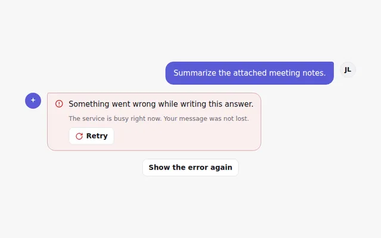](https://mmrahmanbappi.github.io/100-free-ai-ui-components/messages/error-retry/) | **[Error Message with Retry](https://mmrahmanbappi.github.io/100-free-ai-ui-components/messages/error-retry/)** A clear error in the chat when an answer fails, with a Retry button that shows progress and then the answer. |
| [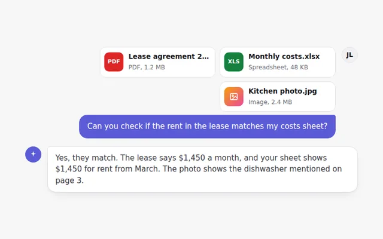](https://mmrahmanbappi.github.io/100-free-ai-ui-components/messages/file-message/) | **[Message with Attached Files](https://mmrahmanbappi.github.io/100-free-ai-ui-components/messages/file-message/)** A user message with attached file cards, showing the file type, name and size, followed by the assistant's reply. |
| [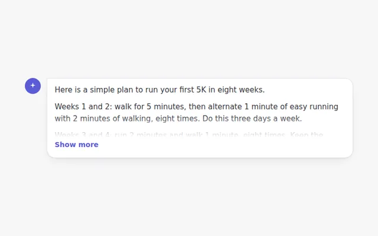](https://mmrahmanbappi.github.io/100-free-ai-ui-components/messages/long-message-toggle/) | **[Long Answer with Show More](https://mmrahmanbappi.github.io/100-free-ai-ui-components/messages/long-message-toggle/)** Long answers fold after a few lines with a soft fade and a Show more button, so the chat stays easy to scan. |

### Answer Feedback

Ratings, thumbs, comparisons and forms that tell you if an answer helped.

| Preview | Component |
|---|---|
| [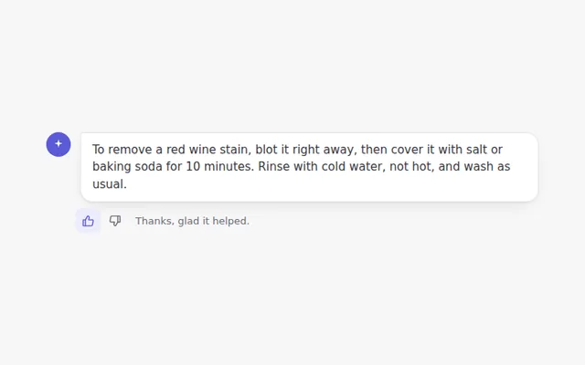](https://mmrahmanbappi.github.io/100-free-ai-ui-components/feedback/thumbs-feedback/) | **[Thumbs Up and Down](https://mmrahmanbappi.github.io/100-free-ai-ui-components/feedback/thumbs-feedback/)** Two small buttons under an answer. Pick one to rate it, pick it again to undo, and see a short thank you. |
| [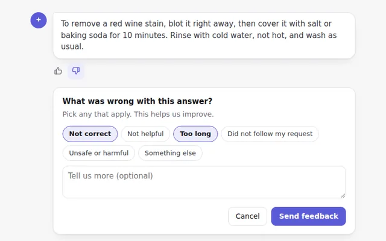](https://mmrahmanbappi.github.io/100-free-ai-ui-components/feedback/thumbs-down-reasons/) | **[Thumbs Down with Reasons](https://mmrahmanbappi.github.io/100-free-ai-ui-components/feedback/thumbs-down-reasons/)** When someone marks an answer as bad, a small panel asks why, with quick reason buttons and an optional comment. |
| [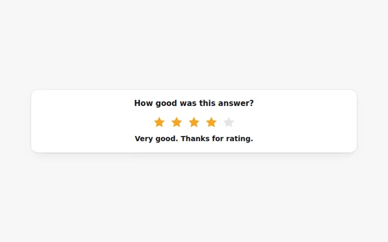](https://mmrahmanbappi.github.io/100-free-ai-ui-components/feedback/star-rating/) | **[Star Rating](https://mmrahmanbappi.github.io/100-free-ai-ui-components/feedback/star-rating/)** Rate an answer from one to five stars with the mouse or keyboard. Each level shows a word, like Good or Excellent. |
| [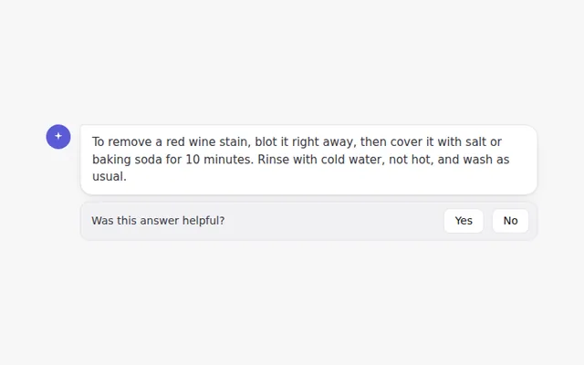](https://mmrahmanbappi.github.io/100-free-ai-ui-components/feedback/helpful-bar/) | **[Was This Helpful Bar](https://mmrahmanbappi.github.io/100-free-ai-ui-components/feedback/helpful-bar/)** A short question at the end of an answer with Yes and No buttons. It turns into a thank you once someone answers. |
| [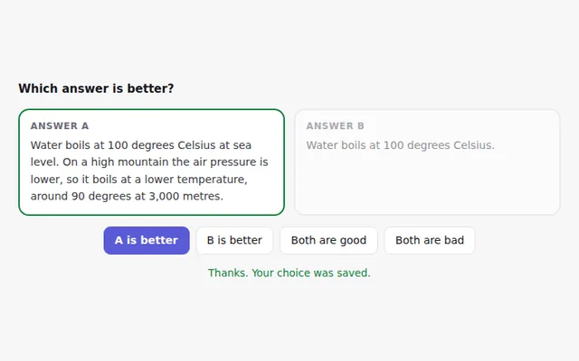](https://mmrahmanbappi.github.io/100-free-ai-ui-components/feedback/compare-answers/) | **[Compare Two Answers](https://mmrahmanbappi.github.io/100-free-ai-ui-components/feedback/compare-answers/)** Two answers side by side so people can pick the better one, or say both are good or both are bad. Useful for testing models. |
| [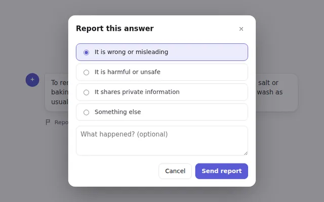](https://mmrahmanbappi.github.io/100-free-ai-ui-components/feedback/report-dialog/) | **[Report a Problem Dialog](https://mmrahmanbappi.github.io/100-free-ai-ui-components/feedback/report-dialog/)** A report button opens a dialog to flag an answer, with categories and details. It traps focus and closes with Escape. |
| [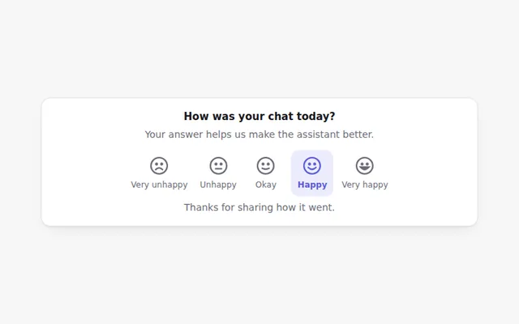](https://mmrahmanbappi.github.io/100-free-ai-ui-components/feedback/satisfaction-scale/) | **[Satisfaction Scale](https://mmrahmanbappi.github.io/100-free-ai-ui-components/feedback/satisfaction-scale/)** Five faces from very unhappy to very happy. A quick way to ask how a chat went, drawn in SVG so it looks the same everywhere. |
| [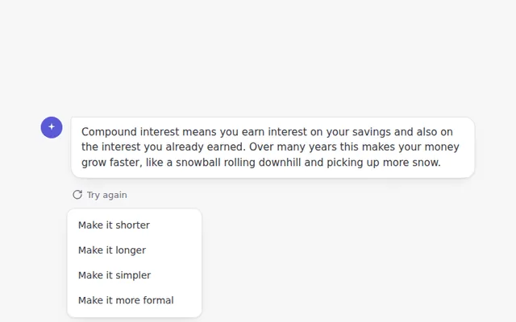](https://mmrahmanbappi.github.io/100-free-ai-ui-components/feedback/rewrite-options/) | **[Rewrite Options Menu](https://mmrahmanbappi.github.io/100-free-ai-ui-components/feedback/rewrite-options/)** A Try again button with a menu to change the answer: shorter, longer, simpler or more formal. The answer updates in place. |
| [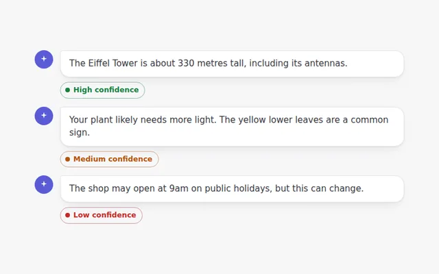](https://mmrahmanbappi.github.io/100-free-ai-ui-components/feedback/confidence-badge/) | **[Confidence Badge](https://mmrahmanbappi.github.io/100-free-ai-ui-components/feedback/confidence-badge/)** A small badge that tells people how sure the AI is about an answer, with a short explanation and a reminder to check sources. |
| [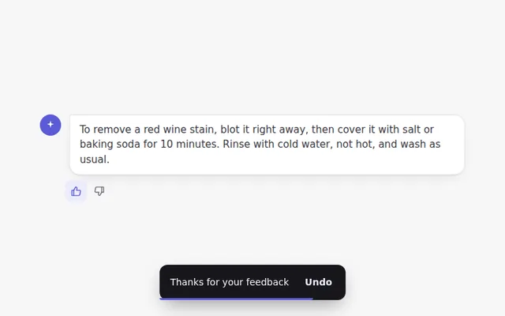](https://mmrahmanbappi.github.io/100-free-ai-ui-components/feedback/feedback-toast/) | **[Feedback Toast with Undo](https://mmrahmanbappi.github.io/100-free-ai-ui-components/feedback/feedback-toast/)** After someone rates an answer, a small message slides up to confirm it, with an Undo button for a few seconds. |

### Tokens and Usage

Token meters, context bars, credits and limits that show what each chat costs.

| Preview | Component |
|---|---|
| [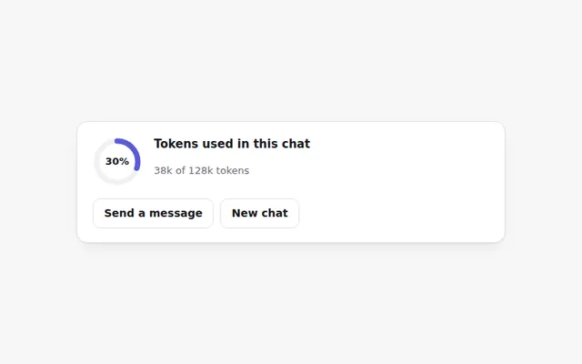](https://mmrahmanbappi.github.io/100-free-ai-ui-components/usage/token-ring/) | **[Token Ring Meter](https://mmrahmanbappi.github.io/100-free-ai-ui-components/usage/token-ring/)** A small ring that fills as a chat uses up its token budget. It turns orange near the limit and red when full, with an exact count on hover. |
| [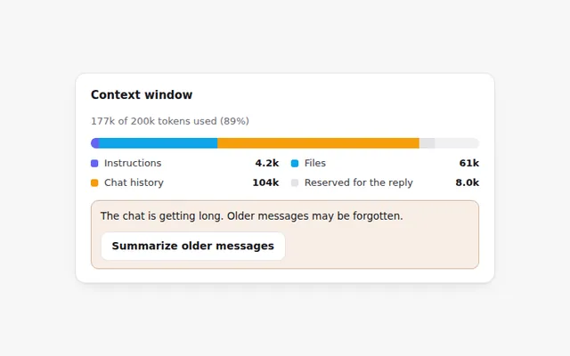](https://mmrahmanbappi.github.io/100-free-ai-ui-components/usage/context-window-bar/) | **[Context Window Bar](https://mmrahmanbappi.github.io/100-free-ai-ui-components/usage/context-window-bar/)** A bar that shows what fills the AI's memory for this chat: instructions, files, chat history and room left for the reply. |
| [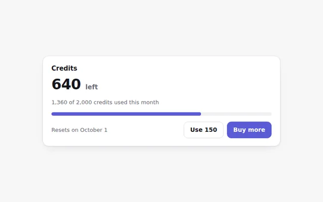](https://mmrahmanbappi.github.io/100-free-ai-ui-components/usage/credits-card/) | **[Credits Remaining Card](https://mmrahmanbappi.github.io/100-free-ai-ui-components/usage/credits-card/)** Shows how many credits are left this month, when they reset, and a button to buy more. The bar changes color as credits run low. |
| [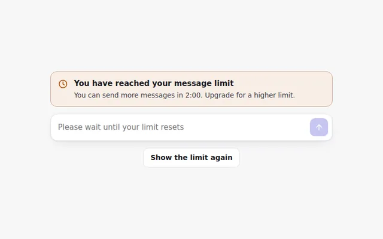](https://mmrahmanbappi.github.io/100-free-ai-ui-components/usage/rate-limit-banner/) | **[Rate Limit Banner](https://mmrahmanbappi.github.io/100-free-ai-ui-components/usage/rate-limit-banner/)** A clear banner when someone hits their message limit, with a live countdown to when they can send again and the prompt box turned off. |
| [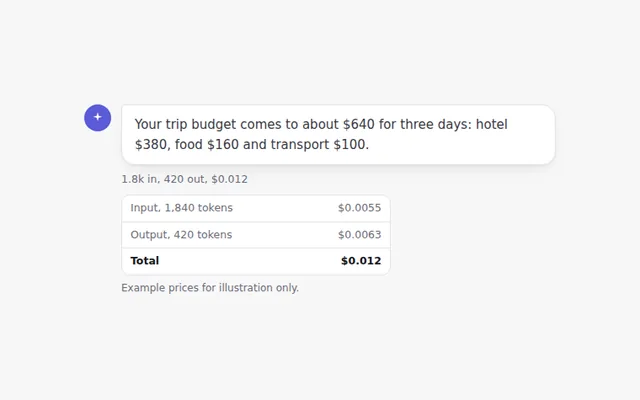](https://mmrahmanbappi.github.io/100-free-ai-ui-components/usage/message-cost/) | **[Cost per Message](https://mmrahmanbappi.github.io/100-free-ai-ui-components/usage/message-cost/)** A small line under each answer showing tokens in and out and what the message cost. Click it to see the full breakdown. |
| [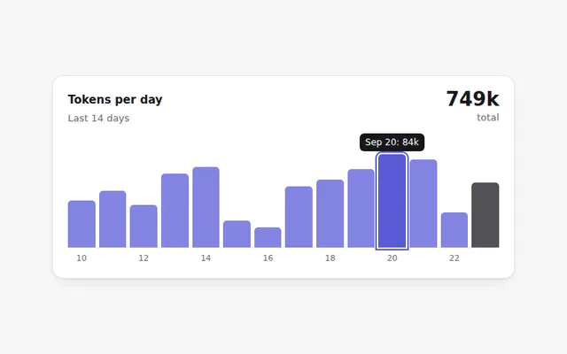](https://mmrahmanbappi.github.io/100-free-ai-ui-components/usage/usage-chart/) | **[Daily Usage Chart](https://mmrahmanbappi.github.io/100-free-ai-ui-components/usage/usage-chart/)** A small bar chart of tokens used each day for two weeks. Hover or use the Tab key to read each day's exact number. |
| [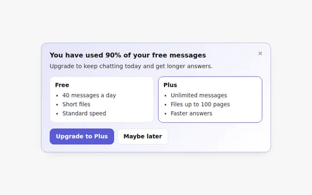](https://mmrahmanbappi.github.io/100-free-ai-ui-components/usage/upgrade-banner/) | **[Upgrade Plan Banner](https://mmrahmanbappi.github.io/100-free-ai-ui-components/usage/upgrade-banner/)** A friendly banner that appears when someone is close to their free limit, comparing free and paid limits. It can be closed. |
| [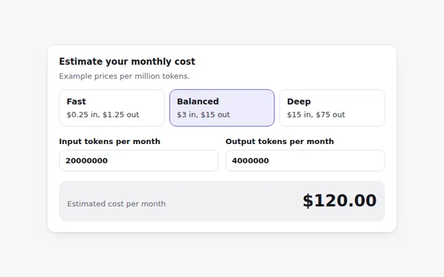](https://mmrahmanbappi.github.io/100-free-ai-ui-components/usage/price-calculator/) | **[Model Price Calculator](https://mmrahmanbappi.github.io/100-free-ai-ui-components/usage/price-calculator/)** Pick a model and enter expected tokens to estimate the monthly cost. Uses example prices that you replace with your own. |
| [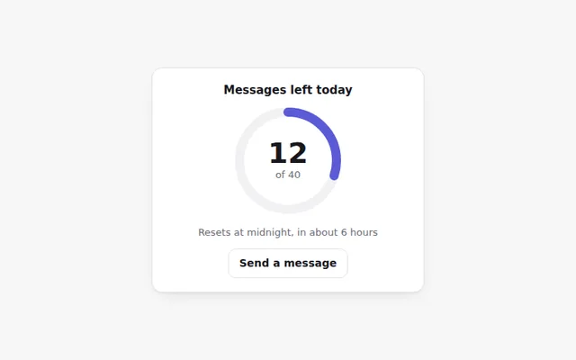](https://mmrahmanbappi.github.io/100-free-ai-ui-components/usage/daily-limit-ring/) | **[Messages Left Today](https://mmrahmanbappi.github.io/100-free-ai-ui-components/usage/daily-limit-ring/)** A ring that counts down the messages left today, with the reset time. Useful for free plans with a daily limit. |
| [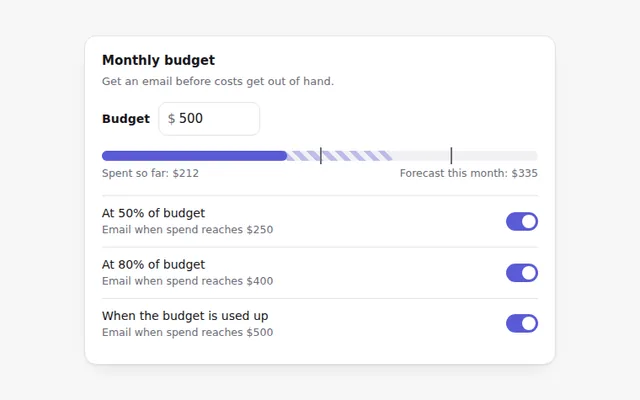](https://mmrahmanbappi.github.io/100-free-ai-ui-components/usage/spend-alerts/) | **[Spending Alerts](https://mmrahmanbappi.github.io/100-free-ai-ui-components/usage/spend-alerts/)** Set a monthly budget and choose when to get an email: at half, most or all of the budget. Shows spend so far and a forecast. |

### Model and Settings

Model pickers, sliders and toggles that control how the AI answers.

| Preview | Component |
|---|---|
| [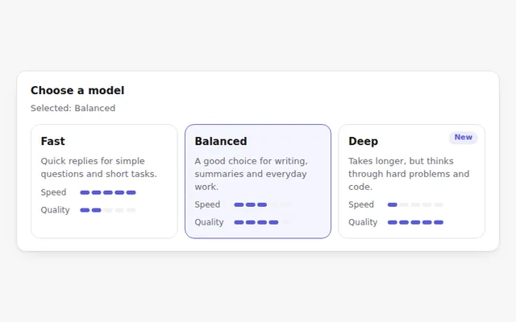](https://mmrahmanbappi.github.io/100-free-ai-ui-components/settings/model-cards/) | **[Model Selection Cards](https://mmrahmanbappi.github.io/100-free-ai-ui-components/settings/model-cards/)** Choose a model from cards that compare speed and quality with small meters. Works with arrow keys like a radio group. |
| [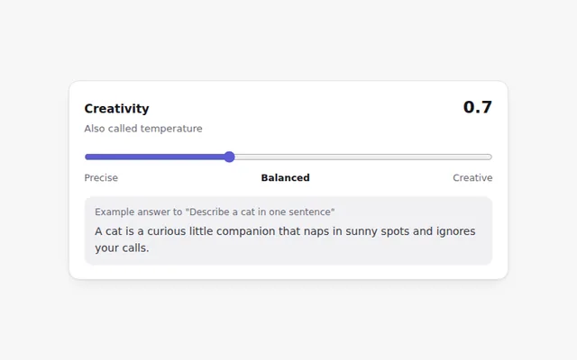](https://mmrahmanbappi.github.io/100-free-ai-ui-components/settings/temperature-slider/) | **[Creativity Slider](https://mmrahmanbappi.github.io/100-free-ai-ui-components/settings/temperature-slider/)** A slider for the model temperature with plain labels from Precise to Creative, a live value, and a sample line that shows the effect. |
| [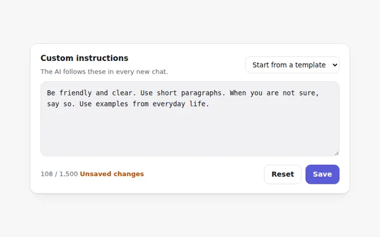](https://mmrahmanbappi.github.io/100-free-ai-ui-components/settings/system-prompt-editor/) | **[System Prompt Editor](https://mmrahmanbappi.github.io/100-free-ai-ui-components/settings/system-prompt-editor/)** Edit the instructions the AI follows in every chat. Includes ready-made starters, a character count, and Save only when something changed. |
| [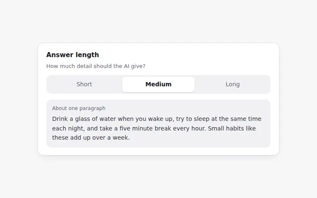](https://mmrahmanbappi.github.io/100-free-ai-ui-components/settings/response-length/) | **[Answer Length Control](https://mmrahmanbappi.github.io/100-free-ai-ui-components/settings/response-length/)** A three-way switch for short, medium or long answers, with a preview that shows how much text each choice gives. |
| [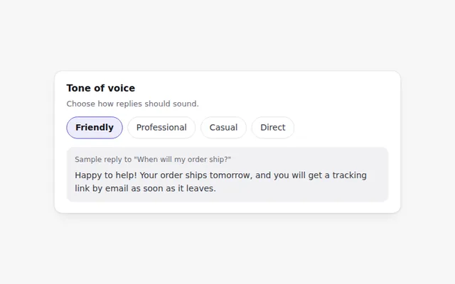](https://mmrahmanbappi.github.io/100-free-ai-ui-components/settings/tone-selector/) | **[Tone Selector](https://mmrahmanbappi.github.io/100-free-ai-ui-components/settings/tone-selector/)** Pick how the AI should sound: friendly, professional, casual or direct. A sample reply updates so people can hear the difference. |
| [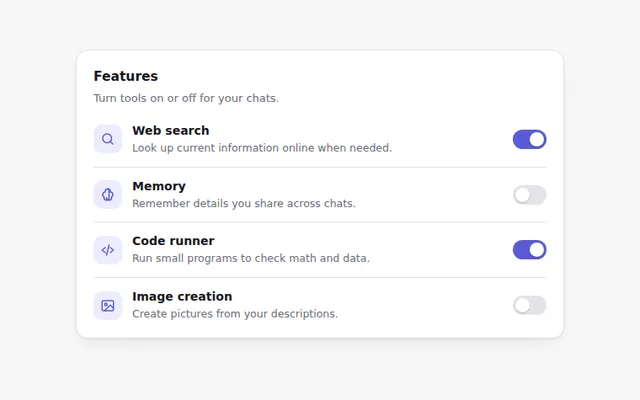](https://mmrahmanbappi.github.io/100-free-ai-ui-components/settings/feature-toggles/) | **[Feature Toggles](https://mmrahmanbappi.github.io/100-free-ai-ui-components/settings/feature-toggles/)** A settings list of switches for AI features like web search, memory and code running, each with a short explanation. |
| [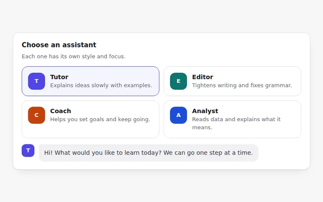](https://mmrahmanbappi.github.io/100-free-ai-ui-components/settings/persona-cards/) | **[Assistant Persona Cards](https://mmrahmanbappi.github.io/100-free-ai-ui-components/settings/persona-cards/)** Cards for different assistant roles, like tutor, editor or coach. Picking one changes how the assistant greets you. |
| [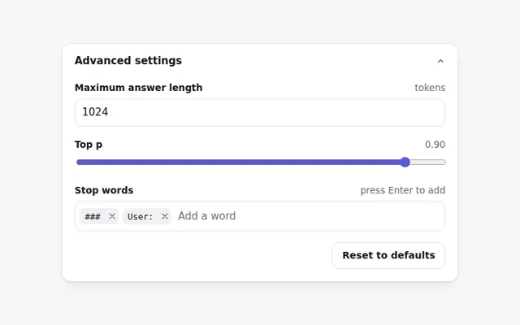](https://mmrahmanbappi.github.io/100-free-ai-ui-components/settings/advanced-parameters/) | **[Advanced Parameters Panel](https://mmrahmanbappi.github.io/100-free-ai-ui-components/settings/advanced-parameters/)** A folding panel for power users: maximum answer length, top p, and stop words you can add and remove, with a reset to defaults. |
| [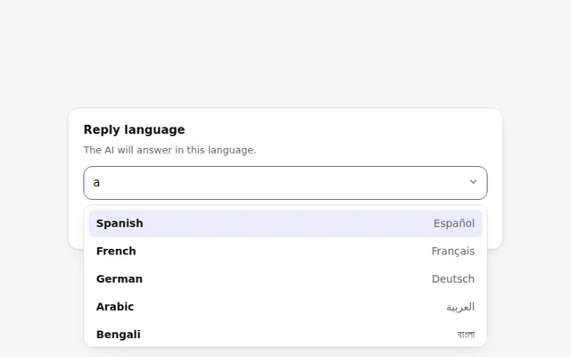](https://mmrahmanbappi.github.io/100-free-ai-ui-components/settings/language-picker/) | **[Reply Language Picker](https://mmrahmanbappi.github.io/100-free-ai-ui-components/settings/language-picker/)** A searchable list to choose the language for answers. Shows each language in its own script and supports right-to-left text. |
| [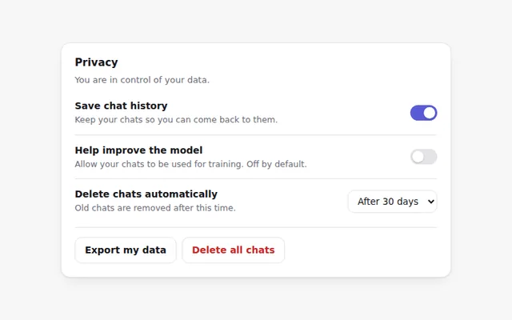](https://mmrahmanbappi.github.io/100-free-ai-ui-components/settings/privacy-controls/) | **[Privacy Controls](https://mmrahmanbappi.github.io/100-free-ai-ui-components/settings/privacy-controls/)** Clear privacy settings for an AI app: save chat history, allow chats to improve the model, auto-delete, plus export and delete with a confirm step. |

### Chat Layouts

Full chat windows, sidebars, widgets and empty states.

| Preview | Component |
|---|---|
| [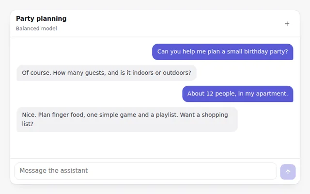](https://mmrahmanbappi.github.io/100-free-ai-ui-components/chat-layout/full-chat-window/) | **[Full Chat Window](https://mmrahmanbappi.github.io/100-free-ai-ui-components/chat-layout/full-chat-window/)** A complete chat screen with a header, scrolling messages and a prompt box at the bottom. Replies stream in, and the view follows along. |
| [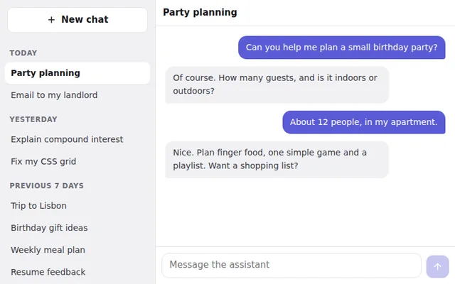](https://mmrahmanbappi.github.io/100-free-ai-ui-components/chat-layout/chat-sidebar/) | **[Chat Sidebar](https://mmrahmanbappi.github.io/100-free-ai-ui-components/chat-layout/chat-sidebar/)** A sidebar with past chats grouped by date, a New chat button and the current chat highlighted. On phones it slides in from a menu button. |
| [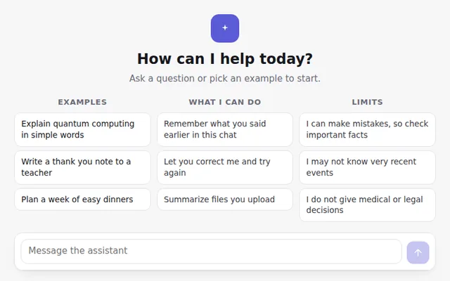](https://mmrahmanbappi.github.io/100-free-ai-ui-components/chat-layout/empty-chat-state/) | **[Empty Chat Welcome Screen](https://mmrahmanbappi.github.io/100-free-ai-ui-components/chat-layout/empty-chat-state/)** The first screen of a new chat: a greeting, example prompts, what the assistant can do and its limits, with the prompt box ready below. |
| [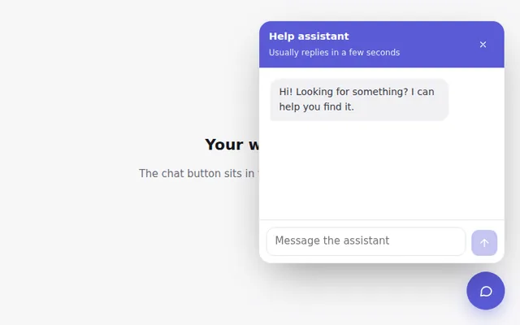](https://mmrahmanbappi.github.io/100-free-ai-ui-components/chat-layout/floating-chat-widget/) | **[Floating Chat Widget](https://mmrahmanbappi.github.io/100-free-ai-ui-components/chat-layout/floating-chat-widget/)** A round chat button in the corner that opens a small chat panel, with an unread badge. Escape or the close button hides it again. |
| [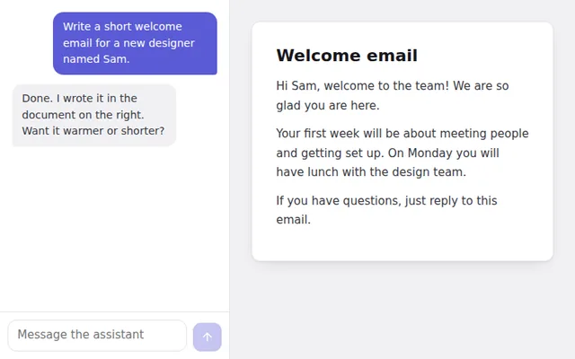](https://mmrahmanbappi.github.io/100-free-ai-ui-components/chat-layout/split-view-chat/) | **[Split View: Chat and Document](https://mmrahmanbappi.github.io/100-free-ai-ui-components/chat-layout/split-view-chat/)** Chat on one side and a live document on the other, the layout used by AI writing tools. On phones it switches to two tabs. |
| [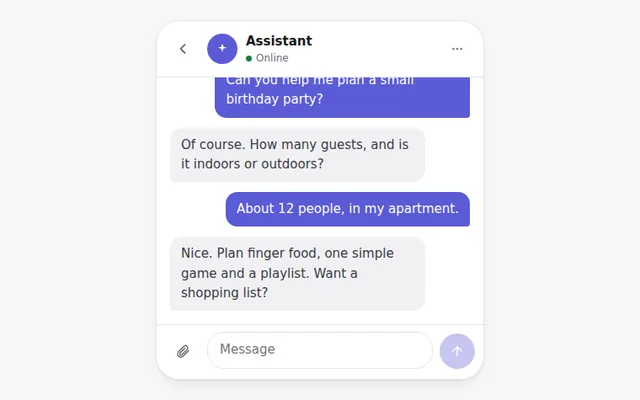](https://mmrahmanbappi.github.io/100-free-ai-ui-components/chat-layout/mobile-chat/) | **[Mobile Chat Screen](https://mmrahmanbappi.github.io/100-free-ai-ui-components/chat-layout/mobile-chat/)** A phone-sized chat with a back button, assistant name and status, messages, and a prompt bar with an attach button, sized for thumbs. |
| [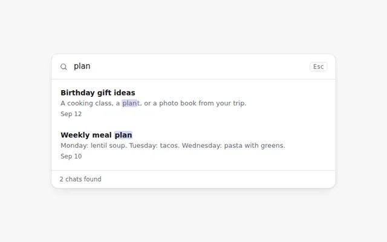](https://mmrahmanbappi.github.io/100-free-ai-ui-components/chat-layout/conversation-search/) | **[Conversation Search](https://mmrahmanbappi.github.io/100-free-ai-ui-components/chat-layout/conversation-search/)** Search through past chats as you type. Matching words are highlighted, and a friendly message appears when nothing is found. |
| [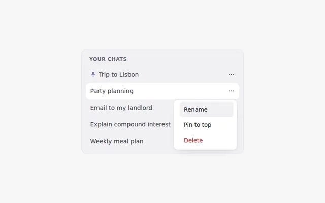](https://mmrahmanbappi.github.io/100-free-ai-ui-components/chat-layout/chat-item-menu/) | **[Chat List Item Menu](https://mmrahmanbappi.github.io/100-free-ai-ui-components/chat-layout/chat-item-menu/)** Each chat in the list has a menu to rename it in place, pin it to the top, or delete it with an undo option. |
| [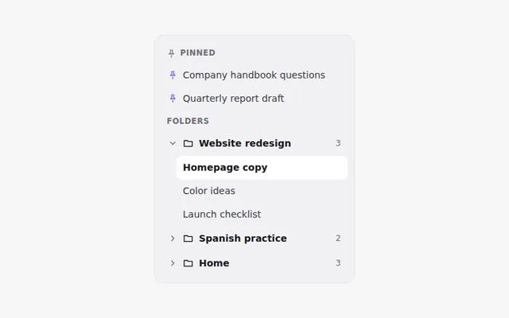](https://mmrahmanbappi.github.io/100-free-ai-ui-components/chat-layout/sidebar-folders/) | **[Sidebar with Pinned Chats and Folders](https://mmrahmanbappi.github.io/100-free-ai-ui-components/chat-layout/sidebar-folders/)** A chat sidebar with a pinned section and folders you can open and close, like projects. It remembers which folders are open. |
| [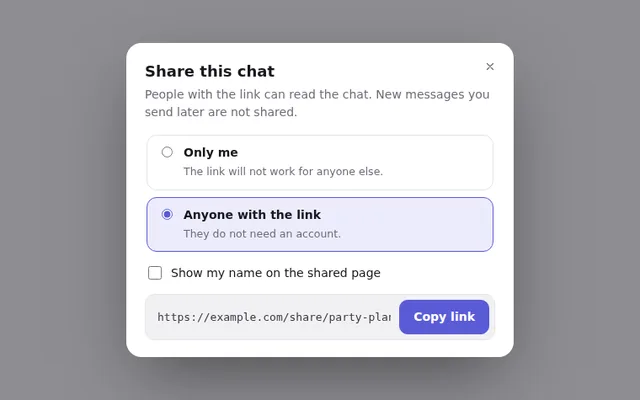](https://mmrahmanbappi.github.io/100-free-ai-ui-components/chat-layout/share-dialog/) | **[Share Conversation Dialog](https://mmrahmanbappi.github.io/100-free-ai-ui-components/chat-layout/share-dialog/)** Share a chat with a link. Choose who can see it, whether to show your name, then copy the link with one click. |

### Agents and Tools

Tool calls, approvals, task plans and logs for AI agents.

| Preview | Component |
|---|---|
| [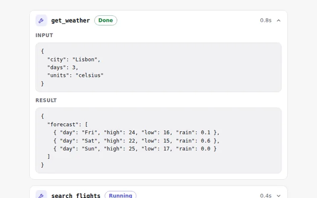](https://mmrahmanbappi.github.io/100-free-ai-ui-components/agents/tool-call-card/) | **[Tool Call Card](https://mmrahmanbappi.github.io/100-free-ai-ui-components/agents/tool-call-card/)** Shows that the AI used a tool, with its name, status and time. Open it to see the exact input and the result it got back. |
| [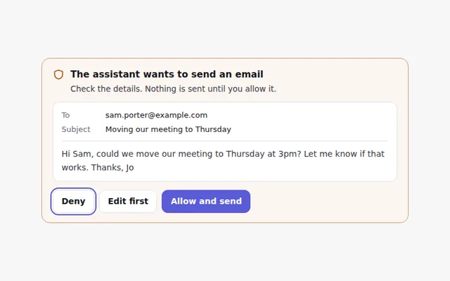](https://mmrahmanbappi.github.io/100-free-ai-ui-components/agents/approval-request/) | **[Action Approval Request](https://mmrahmanbappi.github.io/100-free-ai-ui-components/agents/approval-request/)** Before an agent does something important, like sending an email, it shows exactly what it will do and waits for Allow or Deny. |
| [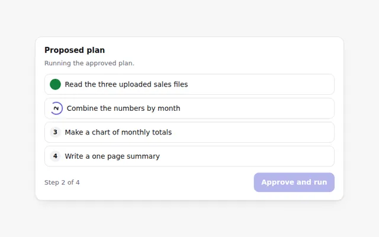](https://mmrahmanbappi.github.io/100-free-ai-ui-components/agents/task-plan/) | **[Editable Task Plan](https://mmrahmanbappi.github.io/100-free-ai-ui-components/agents/task-plan/)** The agent proposes a step by step plan before it starts. People can reorder, edit or remove steps, then approve the plan to run it. |
| [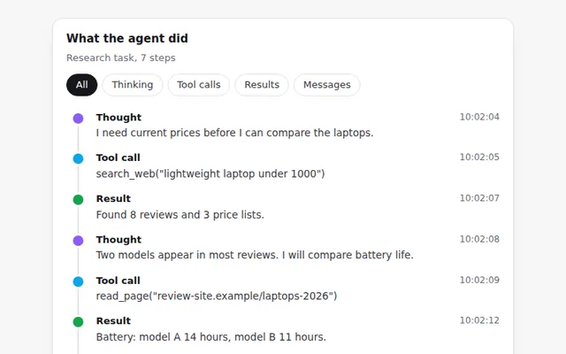](https://mmrahmanbappi.github.io/100-free-ai-ui-components/agents/agent-timeline/) | **[Agent Activity Timeline](https://mmrahmanbappi.github.io/100-free-ai-ui-components/agents/agent-timeline/)** A timeline of everything an agent did: its thinking, tool calls, results and messages, with times and a filter by type. |
| [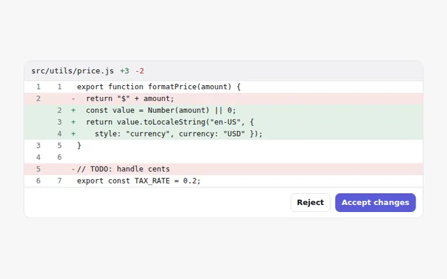](https://mmrahmanbappi.github.io/100-free-ai-ui-components/agents/file-diff/) | **[File Change Preview](https://mmrahmanbappi.github.io/100-free-ai-ui-components/agents/file-diff/)** Shows the changes an AI wants to make to a file, with removed lines in red and added lines in green, and buttons to accept or reject. |
| [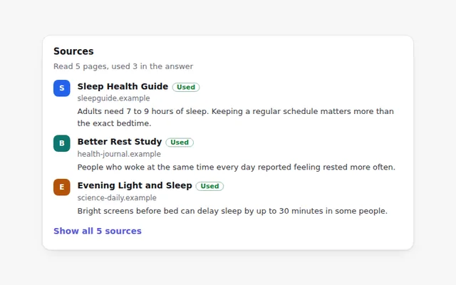](https://mmrahmanbappi.github.io/100-free-ai-ui-components/agents/web-results-card/) | **[Web Results Card](https://mmrahmanbappi.github.io/100-free-ai-ui-components/agents/web-results-card/)** A card listing the web pages an AI read, with title, site and a short excerpt. Pages it used in the answer are marked. |
| [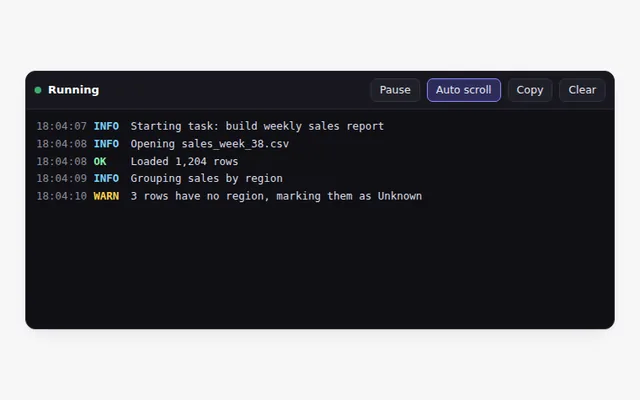](https://mmrahmanbappi.github.io/100-free-ai-ui-components/agents/run-log-console/) | **[Agent Run Log](https://mmrahmanbappi.github.io/100-free-ai-ui-components/agents/run-log-console/)** A terminal style log that streams what an agent is doing, with colored levels, a pause button, auto scroll and copy. |
| [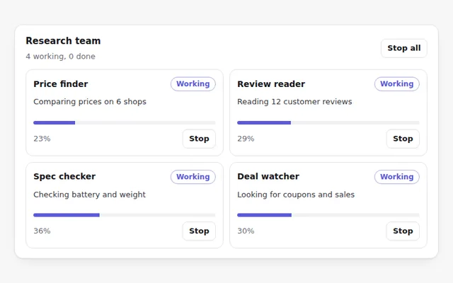](https://mmrahmanbappi.github.io/100-free-ai-ui-components/agents/subagent-grid/) | **[Parallel Agents Status](https://mmrahmanbappi.github.io/100-free-ai-ui-components/agents/subagent-grid/)** A grid of helper agents working at the same time, each with its own task, progress and status, and a button to stop any one of them. |
| [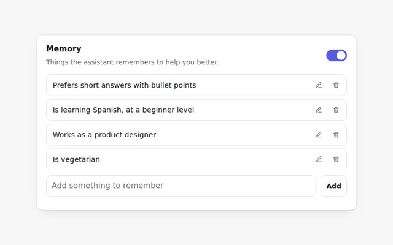](https://mmrahmanbappi.github.io/100-free-ai-ui-components/agents/memory-panel/) | **[AI Memory Manager](https://mmrahmanbappi.github.io/100-free-ai-ui-components/agents/memory-panel/)** A list of things the assistant remembers about someone, with edit and delete for each item, a way to add one, and a switch to turn memory off. |
| [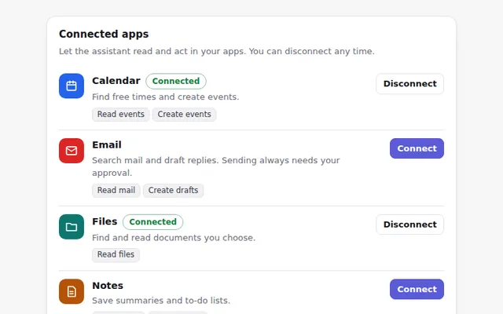](https://mmrahmanbappi.github.io/100-free-ai-ui-components/agents/connectors-list/) | **[App Connectors List](https://mmrahmanbappi.github.io/100-free-ai-ui-components/agents/connectors-list/)** A list of apps the AI can connect to, like calendar, email and files. Each shows what it can access, with Connect and Disconnect buttons. |

### Voice and Media

Voice input, audio answers, image upload and generation progress.

| Preview | Component |
|---|---|
| [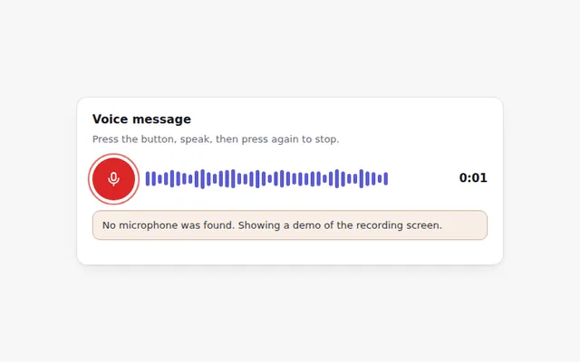](https://mmrahmanbappi.github.io/100-free-ai-ui-components/voice-media/voice-recorder/) | **[Voice Recorder with Waveform](https://mmrahmanbappi.github.io/100-free-ai-ui-components/voice-media/voice-recorder/)** Record a voice message with live bars that follow your voice. Uses the real microphone when allowed, and explains clearly when it is not. |
| [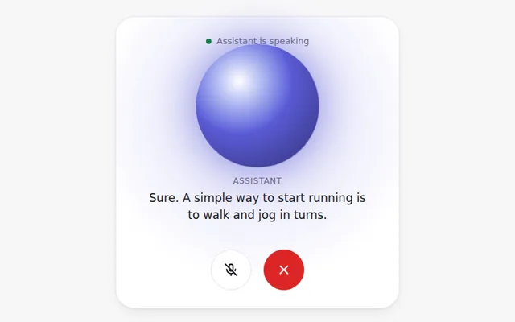](https://mmrahmanbappi.github.io/100-free-ai-ui-components/voice-media/voice-mode/) | **[Voice Mode Screen](https://mmrahmanbappi.github.io/100-free-ai-ui-components/voice-media/voice-mode/)** A full voice conversation screen with a glowing circle that reacts while the AI speaks, live captions, and mute and end buttons. |
| [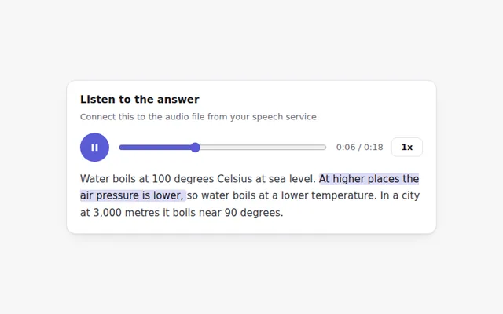](https://mmrahmanbappi.github.io/100-free-ai-ui-components/voice-media/audio-answer-player/) | **[Audio Answer Player](https://mmrahmanbappi.github.io/100-free-ai-ui-components/voice-media/audio-answer-player/)** A compact player for spoken answers with play and pause, a seek bar, playback speed and the matching text highlighted as it plays. |
| [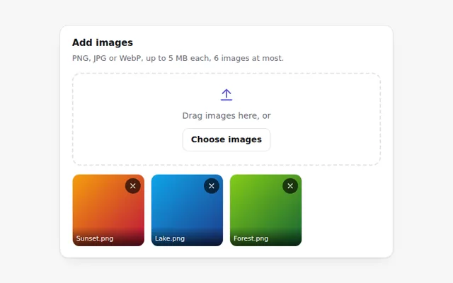](https://mmrahmanbappi.github.io/100-free-ai-ui-components/voice-media/image-upload-preview/) | **[Image Upload with Preview](https://mmrahmanbappi.github.io/100-free-ai-ui-components/voice-media/image-upload-preview/)** Add images by button or drag and drop and see thumbnails right away. Checks the file type and size and explains any problem. |
| [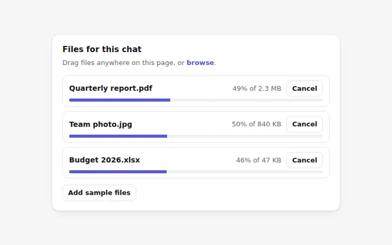](https://mmrahmanbappi.github.io/100-free-ai-ui-components/voice-media/drop-overlay-upload/) | **[Page Drop Zone with Upload Progress](https://mmrahmanbappi.github.io/100-free-ai-ui-components/voice-media/drop-overlay-upload/)** Drag files anywhere on the page to show a full screen drop area. Each file then uploads with its own progress bar and a cancel button. |
| [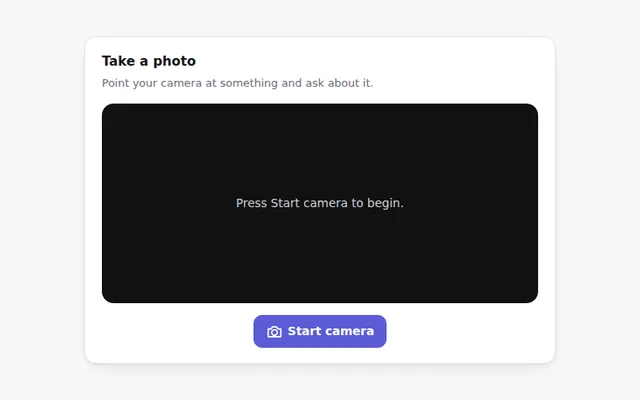](https://mmrahmanbappi.github.io/100-free-ai-ui-components/voice-media/camera-capture/) | **[Camera Photo Capture](https://mmrahmanbappi.github.io/100-free-ai-ui-components/voice-media/camera-capture/)** Take a photo with the device camera to ask the AI about it. Shows a live preview, a shutter button and retake, with a clear message if there is no camera. |
| [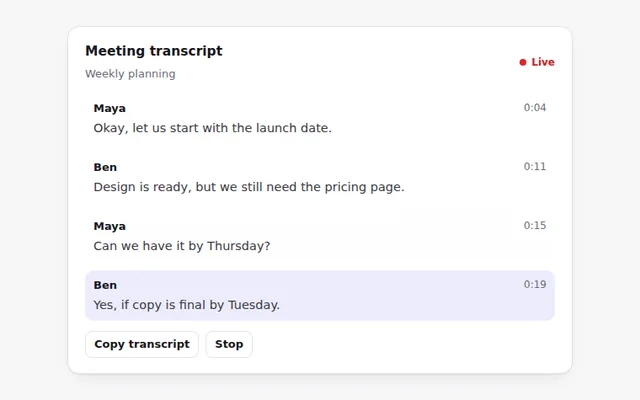](https://mmrahmanbappi.github.io/100-free-ai-ui-components/voice-media/live-transcript/) | **[Live Transcript](https://mmrahmanbappi.github.io/100-free-ai-ui-components/voice-media/live-transcript/)** Captions that appear as people talk, with speaker names and times. The newest line is highlighted, and the full text can be copied. |
| [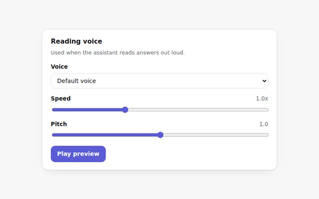](https://mmrahmanbappi.github.io/100-free-ai-ui-components/voice-media/voice-settings/) | **[Voice and Speech Settings](https://mmrahmanbappi.github.io/100-free-ai-ui-components/voice-media/voice-settings/)** Pick a reading voice from the ones in the browser, set the speed and pitch, and hear a preview. Shows a notice when no voices are available. |
| [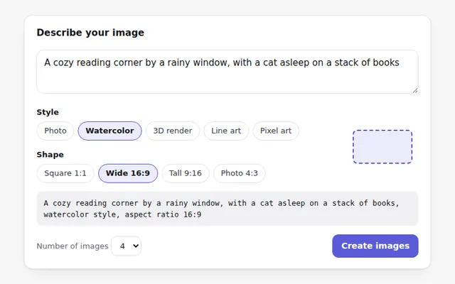](https://mmrahmanbappi.github.io/100-free-ai-ui-components/voice-media/image-prompt-editor/) | **[Image Prompt Builder](https://mmrahmanbappi.github.io/100-free-ai-ui-components/voice-media/image-prompt-editor/)** Write a prompt for an image and pick a style, shape and number of images. A frame shows the chosen shape, and the final prompt updates live. |
| [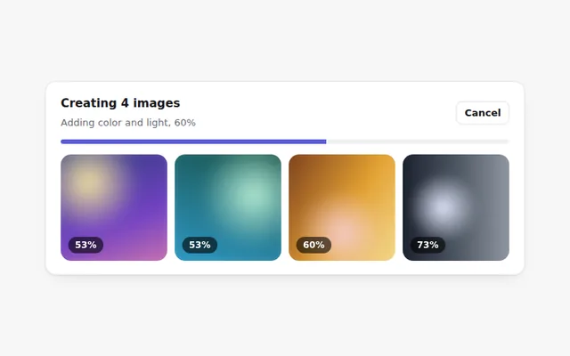](https://mmrahmanbappi.github.io/100-free-ai-ui-components/voice-media/image-generation-progress/) | **[Image Generation Progress](https://mmrahmanbappi.github.io/100-free-ai-ui-components/voice-media/image-generation-progress/)** Shows images being created: tiles start blurry and sharpen as progress grows, with a cancel button, then download and upscale actions. |

## Coming next

Trust and Onboarding.

## License

[MIT](LICENSE). Free for personal and business use.

Made by [MM Rahman Bappi](https://mmseo.app/).
